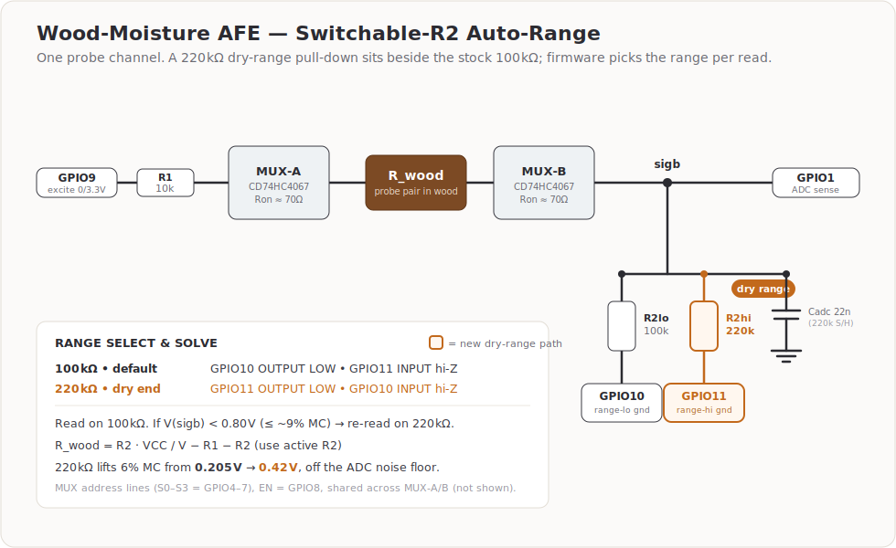

# Black Walnut Air-Drying Moisture Monitor
## Project Documentation — Updated

---

## Overview

A multi-node ESP32-S3 system using pin-type resistance measurement to monitor
moisture content (MC%) across a black walnut air-drying stack in a garage
environment. Each node drives two CD74HC4067 16-channel analog multiplexers
in a dual-MUX configuration (one for excitation, one for ADC sense) for 16
probe pairs per node.

Sensor data reports via StatsD → InfluxDB, matching the existing
temperature/humidity sensor infrastructure already in place.

---

## Dual MUX Design (Updated)

Each node uses **two CD74HC4067 boards** enabled simultaneously:

- **MUX-A**: GPIO2 (excitation) → SIG. Drives excitation through selected channel.
- **MUX-B**: SIG → GPIO1 (ADC). Reads voltage at selected channel.

Both boards share the same S0–S3 address lines and the same EN/GPIO8.
Each probe pair connects to the same channel number on both boards.
This eliminates leakage-induced measurement error from unselected channels.

**Per node: 2 MUX boards, 16 probe pairs, 1 ESP32-S3.**

---

## Stack Layout

### Node 1 — 5/4, 6/4, 7/4 Stock
Three Husky 4-shelf units (77"W × 72"H × 24"D) arranged with 18" gaps,
giving ~9 feet of board run.

- 6/4 and 7/4 on bottom shelves (heavier, higher case-hardening risk)
- 5/4 on upper shelves
- Wire shelves provide airflow; stickers required between board layers

### Node 2 — 8/4 and 9/4 Stock
Dedicated stack. Similar drying timelines group well together.
Up to 16 probe pairs across monitored slabs (2S+2D per slab).

### Node 3 — 10/4 and 11/4 Stock
Higher case-hardening risk group. Monitor shell-to-core differential
closely. Tighten wrap if shallow−deep MC% differential exceeds 5%.

### Node 4 — 12/4, 13/4 Stock
Highest risk and longest drying time. The single 13/4 slab is exceptional —
plan for 3+ years to reach target MC. Give it dedicated probe channels and
treat any differential reading above 4% as an alert.

*Additional nodes can be added as needed. Each requires 1× ESP32-S3 and
2× CD74HC4067 breakout boards.*

---

## Hardware Bill of Materials

| Item | Qty | Source |
|---|---|---|
| ESP32-S3 DevKit | 1 per node | On hand (9 available) |
| CD74HC4067 breakout (2-pack) | 1 pack per node | Amazon |
| 1MΩ resistor (from BOJACK assortment) | 1 per node | Amazon |
| 10kΩ resistor (from BOJACK assortment) | 1 per node | Amazon |
| 100nF ceramic cap | 2 per node | Amazon |
| ER308L stainless TIG wire 1/16" | On hand | Amazon |
| 22 AWG stranded wire 6-color | On hand | Amazon |
| 2-pin screw terminals | 16+ per node | Amazon |
| Mini grabber / alligator clip leads | As needed | Amazon / hardware store |
| Husky 4-shelf unit 77"×72"×24" | 3 (Node 1) | Home Depot |

---

## Probe Lengths — All Thicknesses

Total probe length = 1.25" above-surface stub + insertion depth.
The above-surface stub is where hookup wire or clip lead attaches.
Mark the insertion depth with permanent marker or electrical tape before
inserting. Pre-drill pilot hole with 1/16" bit — do not hammer.

| Nominal | Actual thickness | Shallow depth (1/4) | Deep depth (1/2) | Shallow probe total | Deep probe total |
|---|---|---|---|---|---|
| 5/4  | ~1.25" | 5/16"  | 5/8"   | 1-9/16"  | 1-7/8"  |
| 6/4  | ~1.50" | 3/8"   | 3/4"   | 1-5/8"   | 2"      |
| 7/4  | ~1.75" | 7/16"  | 7/8"   | 1-11/16" | 2-1/8"  |
| 8/4  | ~2.00" | 1/2"   | 1"     | 1-3/4"   | 2-1/4"  |
| 9/4  | ~2.25" | 9/16"  | 1-1/8" | 1-13/16" | 2-3/8"  |
| 10/4 | ~2.50" | 5/8"   | 1-1/4" | 1-7/8"   | 2-1/2"  |
| 11/4 | ~2.75" | 11/16" | 1-3/8" | 1-15/16" | 2-5/8"  |
| 12/4 | ~3.00" | 3/4"   | 1-1/2" | 2"        | 2-3/4"  |
| 13/4 | ~3.25" | 13/16" | 1-5/8" | 2-1/16"  | 2-7/8"  |

### Probe Identification System

With 9 thickness groups, clear labeling before insertion is critical:

- Mark depth stop with a ring of permanent marker around the wire
- Wrap a band of colored electrical tape at the top stub by thickness group:
  - 5/4 → white
  - 6/4 → yellow
  - 7/4 → orange
  - 8/4 → red
  - 9/4 → pink
  - 10/4 → blue
  - 11/4 → green
  - 12/4 → purple
  - 13/4 → black
- Label each probe pair's clip leads with tape flags: node number, channel,
  thickness, position (shallow/deep), and board location in stack

---

## Wiring — All Nodes Identical

### Dual MUX GPIO Assignment

| ESP32-S3 GPIO | Function | Destination |
|---|---|---|
| GPIO1 | ADC Input | MUX-B SIG + R2 top (pull-down junction) |
| GPIO9 | Excitation | R1 top (1MΩ to MUX-A SIG) |
| GPIO4 | MUX S0 | S0 on both MUX-A and MUX-B (parallel) |
| GPIO5 | MUX S1 | S1 on both MUX-A and MUX-B (parallel) |
| GPIO6 | MUX S2 | S2 on both MUX-A and MUX-B (parallel) |
| GPIO7 | MUX S3 | S3 on both MUX-A and MUX-B (parallel) |
| GPIO8 | Enable | EN on both MUX-A and MUX-B (parallel, active LOW) |
| 3.3V  | Power | VCC on both MUX boards |
| GND   | Ground | GND on both MUX boards + all probe– pins |

### Passive Components

- **R1 (1MΩ)**: GPIO2 → MUX-A SIG. Limits excitation current.
- **R2 (10kΩ)**: GPIO1 → GND. Pull-down prevents ADC floating on open circuit.
- **C1 (100nF)**: One per MUX board across VCC/GND, close to chip.

### Signal Path

```
GPIO2 → R1 (1MΩ) → MUX-A SIG → selected C-channel → probe A+ → wood
                                                                    ↓
GPIO1 (ADC reads here) ← MUX-B SIG ← selected C-channel ← probe B+
         ↑
    R2 (10kΩ) → GND   (pull-down, prevents float on open circuit)

All probe– pins → GND bus
```

---

## Probe Placement

- **Width**: center of board width
- **Length**: pair A at 1/3 board length, pair B at 2/3 board length
- **Probe pair spacing**: 1 inch apart, along the grain
- **End exclusion**: minimum 12" from each end (end grain dries 10–15× faster)
- **Depth**: shallow probe at 1/4 depth, deep probe at 1/2 depth

For 11/4, 12/4 and 13/4: drill slowly at deep probe depth, clear chips
frequently to keep the hole straight.

---

## Calibration

### Resistance to MC% (Black Walnut)

```
MC% = 31.62 - 2.985 × log₁₀(R_ohms)
```

Clamped: R > 1,500,000Ω → 6% MC; R < 8,000Ω → 28% MC.

### Temperature Correction

```
MC_corrected = MC - ((T_celsius - 21.1) / 5.6) × 0.5
```

### Resistance Lookup

| Resistance | Approx MC% (black walnut) |
|---|---|
| >1,500,000 Ω | <7% |
| 500,000 Ω | ~8–9% |
| 100,000 Ω | ~12–13% |
| 50,000 Ω | ~16% |
| 20,000 Ω | ~20–22% |
| 10,000 Ω | ~25–28% |

### Field Calibration

1. Insert probe pair into test board
2. Measure resistance across probes with multimeter
3. Compare MC% output to commercial meter on same board
4. Adjust `cal_a` (31.62) and `cal_b` (2.985) substitutions in YAML to match

---

## Drying Time Estimates (Air Drying, Garage, Controlled Wrap)

| Nominal | Estimated time to ~8% MC |
|---|---|
| 5/4  | 6–9 months |
| 6/4  | 9–12 months |
| 7/4  | 10–14 months |
| 8/4  | 14–20 months |
| 9/4  | 18–24 months |
| 10/4 | 20–30 months |
| 11/4 | 24–36 months |
| 12/4 | 28–40 months |
| 13/4 | 36–48+ months |

Target final MC% for interior woodworking in Boise, Idaho: **6–8%**
Maximum safe MC drop rate in early drying (MC >20%): **~1% per week**

---

## Node Channel Allocation (Suggested)

### Node 1 — 5/4, 6/4, 7/4
MUX-A and MUX-B both enabled, 16 channels:
- CH00–CH03: 5/4 boards (4 boards × 1S+1D pair each)
- CH04–CH07: 6/4 boards (4 boards × 1S+1D pair each)
- CH08–CH11: 7/4 boards (4 boards × 1S+1D pair each)
- CH12–CH15: spare / additional boards

### Node 2 — 8/4, 9/4
- CH00–CH07: 8/4 slabs (4 slabs × 2S+2D = 16 channels... exceeds 16)
- Recommend: 4 channels 8/4 (2 slabs × 2S+2D) + 4 channels 9/4 (2 slabs × 2S+2D)
  = 8 channels, leaving 8 spare for additional boards

### Node 3 — 10/4, 11/4
- CH00–CH07: 10/4 slabs (4 channels per slab, 2 slabs)
- CH08–CH15: 11/4 slabs (4 channels per slab, 2 slabs)

### Node 4 — 12/4, 13/4
- CH00–CH07: 12/4 slabs (4 channels per slab, 2 slabs)
- CH08–CH11: 13/4 slab (4 channels — this one slab gets full coverage)
- CH12–CH15: spare / overflow from other thickness groups

*Expand to additional nodes as inventory and channel count require.
Each node needs 1× ESP32-S3 (you have 9) and 1× 2-pack CD74HC4067.*

---

## InfluxDB / Grafana Dashboard Suggestions

Data pipeline and the StatsD/InfluxDB tag+field schema are documented in
[`data/README.md`](data/README.md).

- Per-board MC% trend lines by thickness group
- Shell vs core differential (Shallow − Deep) per probe pair
- Alert: differential > 5% on any 10/4+ board → tighten wrap
- Alert: differential > 4% on 13/4 board → immediate attention
- MC% vs ambient RH correlation
- Estimated days to target MC (linear regression after 2–3 weeks of data)

---

## Auto-Ranging for the Dry End (Optional)

The stock front end uses a single 100&nbsp;kΩ pull-down (`R2`). It spreads the full
8&nbsp;kΩ–1.5&nbsp;MΩ wood-resistance span well, but at the bone-dry end — exactly where
you decide a board is furniture-ready — 6% MC reads only **0.205&nbsp;V**, down in the
ESP32-S3 ADC's noisy low-voltage floor.

Adding a second, switchable pull-down (**220&nbsp;kΩ**) beside the 100&nbsp;kΩ lifts that
same reading to **0.42&nbsp;V**, back in the linear zone. No extra chips: each pull-down
is grounded by its own GPIO used as a switched ground. Firmware reads on the 100&nbsp;kΩ
range and, when a channel drops below ~0.8&nbsp;V (≤ ~9% MC), re-reads it on the
220&nbsp;kΩ range with the matching solve constant.



- Circuit / SPICE trade-off: [`spice/README.md`](spice/README.md) → "Component value selection"
- ESPHome integration (config + drop-in channel lambda): [`esphome/AUTORANGE.md`](esphome/AUTORANGE.md)

The shipping design stays at 10&nbsp;k/100&nbsp;k; the 220&nbsp;k path is only exercised for
channels that have already dried past ~9% MC.

## Files in This Package

| File | Description |
|---|---|
| `wood_moisture_project.md` | This documentation (updated) |
| `wood_moisture_design_update.md` | Dual MUX fix, PSoC 5LP comparison, clip solution |
| `moisture_dual_mux_wiring.png` | Dual MUX wiring diagram |
| `media/moisture_autorange_wiring.svg` | Switchable-R2 (100k/220k) auto-range front end |
| `moisture_psoc5lp_design.png` | PSoC 5LP design overview |
| `moisture_sensor_wiring_3node.png` | Three-node overview |
| `moisture_sensor_wiring.png` | Single-node breadboard reference |
| `moisture_sensor_pinout.png` | Pin connection reference |
| `wood_moisture_node1.yaml` | ESPHome Node 1 — 5/4, 6/4, 7/4 |
| `wood_moisture_node2.yaml` | ESPHome Node 2 — 8/4, 9/4 |
| `wood_moisture_node3.yaml` | ESPHome Node 3 — 10/4, 11/4 |
